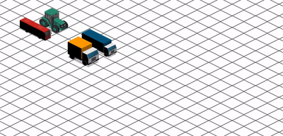

# Animation Station

Bring these graphics to life with CSS!

## What you will be doing

This project will allow you to practise using:

> - CSS z-index
> - CSS Transform
> - CSS @keyframes
> - CSS Background position
> - CSS Translate function
> - CSS Rotate function

This project assumes you've already had experience with:

> - Styling with CSS and SCSS
> - HTML

## Getting started

### Installation

In your terminal, run `npm install`

### Usage

In the terminal, running the following command

`npm run start`

It will:

1) Run the SASS file watcher 
2) Run the npm live-server

## Research

If you feel you need a refresher, you may find the following links useful.

##### CSS Transform
> [CSS Transform (en)](https://developer.mozilla.org/en-US/docs/Web/CSS/transform)
>
> [CSS Transform (de)](https://developer.mozilla.org/de/docs/Web/CSS/transform)

##### Using CSS Animations
> [Using CSS animations (en)](https://developer.mozilla.org/en-US/docs/Web/CSS/CSS_Animations/Using_CSS_animations)
> 
> [CSS Animationen nutzen (de)](https://developer.mozilla.org/de/docs/Web/CSS/CSS_Animations/Using_CSS_animations)

## Tasks

## Task 1 - Rainy days

_Preview_

> Research:
> 
> [CSS Background position (en)](https://developer.mozilla.org/en-US/docs/Web/CSS/background-position)
> 
> [CSS Background position (en)](https://developer.mozilla.org/de/docs/Web/CSS/background-position)

1. Using the `images/raindrops.jpg` background image, set a repeating background for the `<section>` `'rainy-days'`

2. Animate the background to move from top to bottom using CSS3 features `@keyframes` and `animation`

3. Create a new HTML element inside the `<section>` tag, then using CSS3 set the `images/totoro.gif` image to move
from right to left

> **Hint**: You can animate the property `background-position` to move the background image.

## Task 2 - Retro platformer

1. Set the background colour for the `<section>` tag `'retro-platformer'` to something blue

2. Create an HTML element inside the `<section>` tag, then using CSS3 set the 'bullet-bill' image to move
from right to left

3. Create a new HTML element inside the `<section>` tag, then set the `images/mario.png` image as the background

4. Animate the mario character to run, jump, land and continue running

## Task 3 - Space Journey

> Research:
> 
> [CSS Rotate function (en)](https://developer.mozilla.org/en-US/docs/Web/CSS/transform-function/rotate)

1. Using the `images/space.jpg` background image, set a static background for the `<section>` `'space-journey'`.

2. Create a new HTML element inside the `<section>` tag using position absolute, set the `images/spaceship.png` image as
the background

3. Animate the spaceship position:
    - from the top left of the screen to the top right of the screen
    - from the top right of the screen to the bottom right of the screen
    - from the bottom right of the screen to the bottom left of the screen
    - from the bottom left of the screen to the top left of the screen
    - ensure the animation performs in one continuous loop

4. Using the property `transform` with the `rotate()` function, animate the spaceship rotation to coincide
with its position on the screen

## Task 4 - Digital Traffic

_Preview_

> Research:
>
> [CSS Translate function (en)](https://developer.mozilla.org/en-US/docs/Web/CSS/transform-function/translate)

> [CSS z-index (en)](https://developer.mozilla.org/en-US/docs/Web/CSS/z-index)
>
> [CSS z-index (en)](https://developer.mozilla.org/de/docs/Web/CSS/z-index)

1. Using the `images/isometric.png` background image, set a repeating background for the `<section>` `'digital-traffic'`

2. Create a new HTML elements inside the `<section>` tag, for each of the following graphics:
   - `images/bus.png`
   - `images/lorry.png`
   - `images/tractor.png`
   - `images/truck.png`

3. Using `position: absolute`, place the elements next to each other, to imitate a road of 2 lanes

4. Animate each vehicle to all move alongside each other at the same speed (so they don't crash!)
   and that they follow the isometric lines accurately

> **Hint**: You will need to move them horizontally and vertically, but you may have to use some trial and error
to determine the correct values

> **Hint**: You only need to animate the `transform` property with the `translate(x, y)` function

> **Hint**: Use the `z-index` property to give the illusion that some vehicles are behind or in front of each other
